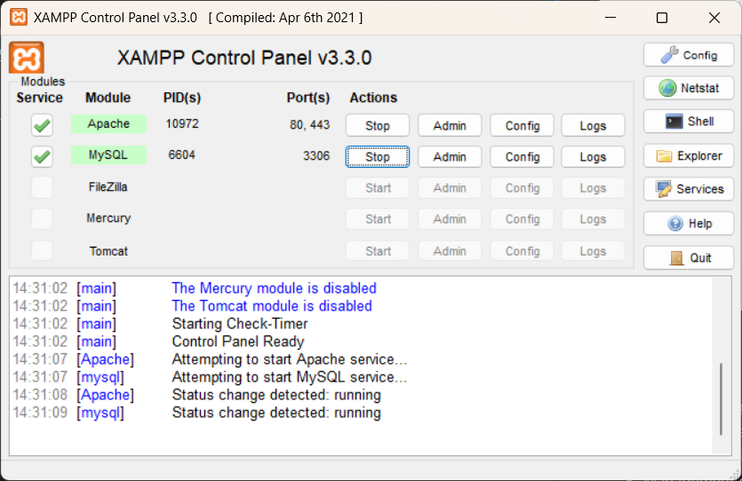

# Stein's Lab

## Description

Stein's Lab is a desktop application for the management of medical analysis laboratories (e.g blood work analysis).
The develepment of this application was part of my graduation project for a bachelor's degree based in [The University Of Jijel](https://univ-jijel.dz/index.php/en/)

## Features

- Management patient's data, medical documents and payments.
- Storing samples data and results.
- Results validation.
- Management of employees roles and privileges.
- Management of supply of tools and equipments.
- Accounting.

Check [the Application Report](Developement%20Report/Stein's%20Lab%20Developpement%20Report.pdf) for more information.

## Installation

1. Download and Install [XAMPP](https://www.apachefriends.org/)
2. Open XAMPP and run "Apache" and "SQL" services
   
3. Access phpmyadmin service through your browser (http://localhost/phpmyadmin)
4. Import the [database example](Database/stein.sql) in the folder "Database"
5. Open the folder "Server Source Code" in your IDE (e.g: IntelliJ IDEA) and run the code.
6. Open the folder "Client Source Code" in your IDE (another window) and run the code.
7. If all goes well the application should start and connect to the server.

**Note** : Don't forget to add the dependencies to your projects (e.g: mysql-connector.jar)

## Usage

The application requires login credentials to access. You can use *username*: "hamzaChera" , *Password*: "hisoka44" to access the manager's interface to view and manage users login data and previliges.

# Contribution
## My contribution

- I made the UI/UX design for the application. [(View in Figma)](https://www.figma.com/design/pvkhnrsYcVuxjqlpqVhOdg/Steins-Lab-UI-Design?node-id=0-1&t=3V2pj2qJZRG6aSiK-1)
- I reviewed UML diagrams made by my colleagues and refined them into the final version. [(View here)](Application%20Design%20UML/Exported)
- I wrote the entirety of the application developement report. [(View here)](Developement%20Report)

## My team's contribution

- Working on the application design and creating initial UML diagrams. 
- Writing the code for the application.

# Project's Status

The development of this project has stopped completely.

This repository is only for displaying the project's developement and the final version we arrived at. This is not meant to be used as a final product, the code may contain bugs or lack optimization.

